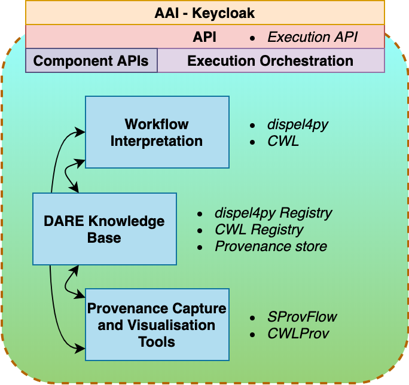

# Introduction

In recent years, modern science has relied more than ever on large-scale data as well as on distributed computing and human resources. Scientists and research engineers in fields such as climate science and computational seismology, constantly strive to make good use of remote and largely heterogeneous computing resources (HPC, Cloud, institutional or local resources, etc.), process, archive and analyse results stored in different locations and collaborate effectively with other scientists.

The DARE platform enables the seamless development and reusability of scientific workflows and applications, and the reproducibility of the experiments.  More information on DARE can be found in [@klampanos2019dare; @atkinson2019comprehensible; @atkinson_malcolm_2020_3697898].

# The DARE Platform

The DARE platform is designed to live in-between user applications and the underlying computing resources. It is built on top of containerisation as well as parallelisation technologies, e.g. Kubernetes and MPI. Interfacing with client systems and end-users is achieved via RESTful APIs. The execution of scientific workflows is achieved via a Workflows-as-a-service layer, which can handle workflows described in either the dispel4py Python library[@Filgueira2017], or in the Common Workflow Language (CWL)[@amstutz2016common].

   

The main components of the DARE platform are:

1. Workflow interpretation
   1. Dispel4py
   2. CWL
2. DARE knowledge base
   1. Dispel4py registry, which registers dispel4py workflows
   2. CWL registry, similar to the dispel4py registry for the CWL case
   3. Provenance store 
3. Provenance capturing and visualisation
   1. SProvFlow, for filtering and visualising data provenance
   2. CWLProv, for capturing provenance information in CWL workflows, based on @khan2019sharing.
4. DARE API
   1. Exposition of part of components’ APIs, making use of [Kubernetes Ingress](https://kubernetes.io/docs/concepts/services-networking/ingress/).
   2. Execution API: a RESTful Web Service exposing dispel4py and CWL execution, while also providing basic file handling functionality.
   3. Keycloak API: Exposes AAI endpoints based on [Keycloak](https://www.keycloak.org/), for modularity and ease of integration with external authentication mechanisms.

# Developer-friendly WaaS

DARE offers user-friendly development, execution and monitoring of two complementary types of workflows: dispel4py and CWL. The platform accommodates the execution of such workflows in dynamic contexts, in the Cloud. Once a workflow has been developed and registered, it can be executed by name via  RESTful endpoints.

## Dynamic Loading of Execution Contexts

Execution environments are loaded on-demand, based on access of specific endpoints of the Execution API. Currently, the platform offers three different execution environments, for dispel4py workflows, CWL workflows and [SPECFEM3D-Cartesian](https://geodynamics.org/cig/software/specfem3d/) - a well-received code for simulating seismic wave propagation[^2]. In this section, we introduce the CWL execution environment, as it is more widely recognisable, however the procedure is similar to the case of dispel4py.

[^2]: The SPECFEM3D endpoint is now obsolete, however we include it for completeness.

Before users can make use of arbitrary, CWL-based execution environments they need to have the corresponding docker containers registered on the platform. The DARE platform installation administrator is responsible for testing and registering such environments, ensuring they are free from malicious software and that they behave as intended.

Once the execution environment, realised by a docker container, has been registered, scientists and research engineers can make use of it for their scientific workflows. The CWL registry allows users to register multiple bash and python scripts and associate them with specific docker containers. After registration, execution environments and CWL workflows are identified by name and version.

For executing a CWL workflow, The Execution API dynamically loads the corresponding execution environment and starts the workflow via the underlying Kubernetes container orchestration layer. DARE shields users from underlying implementation details whilst it allows them to share, restart or monitor their workflow-based applications.

## Ease of use and monitoring

Alongside API-based access, DARE offers a testing environment, the *Playground*, where users can develop and test their workflows. Through the Playground API, we provide a simulation of the dispel4py workflow execution giving users immediate access to the logs and output files. In addition, users are provided with interactive tools to register and describe processing elements and complete workflows, which allows sharing, findability and reusability of methods. The platform also provides interactive provenance tools, enabling users to track workflow execution during run-time. 

# DARE Platform Use-cases

The DARE platform is currently used in the following domain applications:

1. Seismology: [Rapid Assessment (RA) of ground motion parameters during large earthquakes](https://gitlab.com/project-dare/WP6_EPOS).
2. Seismology: [Moment Tensor 3D (MT3D) for ensemble-type of seismic modelling](https://gitlab.com/project-dare/WP6_EPOS).
3. Volcanology: [Ash fall hazard modelling](https://gitlab.com/project-dare/wp6_volcanology).
4. Climate-change: [Extending Climate4Impact with efficient and transparent access to diverse computing resources](https://gitlab.com/project-dare/WP7_IS-ENES_Climate4Impact).
5. Atmospheric sciences: [Cyclone tracking and visualisation application](https://gitlab.com/project-dare/wp7_cyclone-tracking).
 

## Contributions of the DARE Platform

In the use-case listed above the DARE platform achieves the following:
1. It interfaces with users and external systems via a comprehensive and secure RESTful API
2. It facilitates the development of modular, reusable and shareable solutions via its workflow registries
3. It allows for the combination of different workflow approaches, dispel4py and CWL, within the same platform and development environment
4. Via its execution API it orchestrates the dynamic spawning and closing of MPI clusters on the cloud for MPI-enabled components, e.g. the SPECFEM3D-Cartesian model and the dispel4py MPI mapping
5. It provides a flexible environment which local administrators can parametrise by adding custom docker-based environments and user interfaces
6. It collects, mines and visualises provenance information from previous runs

# Software

The DARE platform is available on [GitLab](https://gitlab.com/project-dare/dare-platform). We also have a [GitLab page](https://project-dare.gitlab.io/dare-platform/) with installation instructions, API documentation and a short demo. A demo is available in the [DARE Execution API GitLab Repository](https://gitlab.com/project-dare/exec-api/-/tree/master/examples/mySplitMerge) and can be used as an integration test.

Each DARE component typically include its own tests, client-side helper functions or a short jupyter notebook demo. 

# Future Work

Directions for future work include the following:

1. Make use of provenance data and workflow metadata to further automate the optimisation of workflow execution.
2. Provide wider-ranging search facilities to users for data, components and containerised environments.
3. Provide of-the-shelf integration with domain-specific as well as generic repositories (e.g. with [Zenodo](https://zenodo.org/)) in order to facilitate better Open Science best practices.

# Acknowledgements

This work has been supported by the EU H2020 research and innovation programme under grant agreement No 777413.

# References
